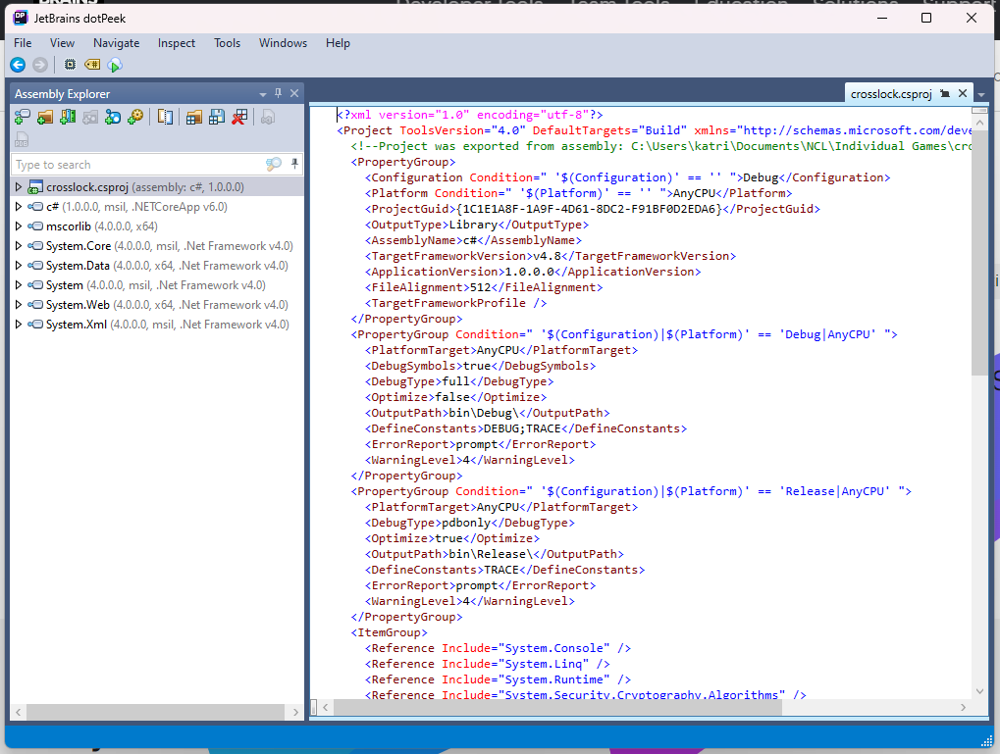
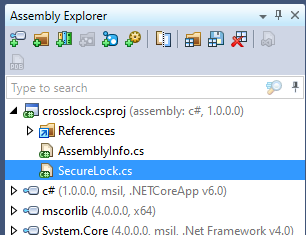

## <u>Intro</u>

So, I need to be vaguer about this write-up, but I wanted to put out something regarding a recent competition I did. It was a lot of fun. How I did was significantly better than it had been. I went from getting 717th place to 244th place. So that means I met my goal this year!! Anyway, I'm going to do a quick write-up of one of their sections.

This section was under their "Enumeration and Exploitation" category. It was the medium challenge and was indeed quite the challenge. I want to write about this one because I had to write some Python scripts for it, which I found to be a lot of fun.

## <u>Methodology</u>

This one involved a .dll file that we had to find the flag within. The whole point was to try to "unlock" the program. Figure out how to view the code and get into the thing. This was a whole process not only to do but to figure out *how* to do it. 

### How?

My first thought was to try to run it, but I was worried about running a .dll on my device, for obvious reasons (still tried to though... do not recommend it... nothing happened it's just a stupid idea). So, after going to other problems for a while, I came back to this one. After looking up "how to open .dll" and things like that, I eventually figured out that you needed to use a decompiler to look at the .dll code. So, I started looking up decompilers and eventually found a couple of opens. The main one I used was a JetBrains based decompiler called [dotPeek](https://www.jetbrains.com/decompiler/). 

### Taking Action

Once I got all that up and running, I opened the .dll in the decompiler and started digging around. This is what I saw:



I then clicked the dropdown next to the crosslock app and one function *immediately* stuck out to me.



So, I opened it up, and, lo and behold, there was everything, although not exactly in the format I wanted. Firstly, this was an AES encrypted key, so I was provided with a key and an IV. On top of that, I was given the encrypted flag, however, it was... well... encrypted. So I had to do a little messing around...

### The Scripts

First, the key, IV, and secret were given in bytes. So I had to figure out how to get bytes into human-readable text. I found this solution to that:

```python
>>>bytes = [<key>] 
>>>"".join(map(chr, bytes))
```

Which outputs the key for me. It was pretty easy to notice without converting the IV, but the key and IV were the same. I could tell due to the bytes being the same. So I didn't bother to go through the whole process with both. Once I had that, I needed to figure out how to get the encrypted flag. 

I stumbled around a while trying to figure out how to best output this stuff as putting it into the same script I had for the key just output a garbled mess. So, I made a guess and tried to make a script that outputs hex for me. This is what I came up with:

```python
>>>bytes = [<secret>]
>>>''.join(format(x, '02x') for x in bytes)
```

### Finding The Flag

This gave me the flag in hex. The reason it was so garbled was that it was encrypted with AES, so I took the hex, went into [Cyberchef](https://gchq.github.io/CyberChef/#recipe=AES_Decrypt(%7B'option':'Hex','string':''%7D,%7B'option':'Hex','string':''%7D,'CBC','Hex','Raw',%7B'option':'Hex','string':''%7D,%7B'option':'Hex','string':''%7D)) and put in the AES Decrypt option (which that link should've led you to). From there, I put the hex in, input the key and IV, changed the format of the key and IV to UTF8, and baked! And that's how I got the flag.

---

If you want to see more writeups from me, feel free to comment, or send me a message either of the ways I have available in my [about](http://kd0ve.github.io/about/). Let me know if you'd like more!

---


