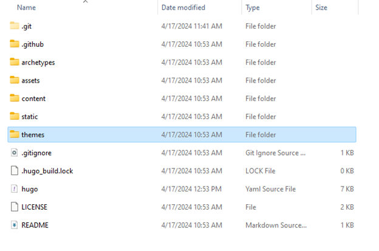
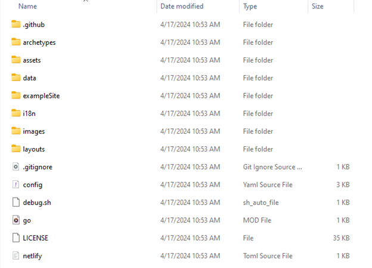
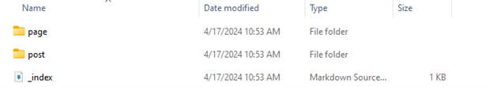
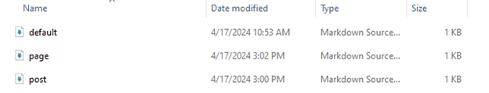
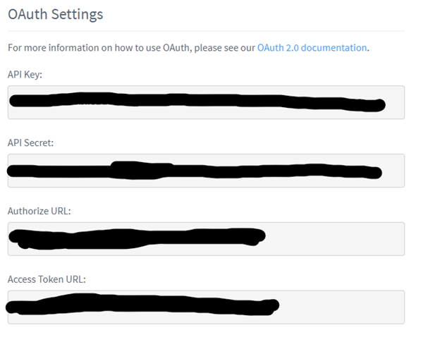

This post is going to be about how I would go about setting up a website like mine now that I’ve done it. I’ve learned a lot, and ran into a lot of specific issues, and figured I could be helpful to others who run into these weird little issues too, as it was difficult to find information on them online. 

I’m not going to be going over the specifics of Hugo or really going into detail certain terms I am using. I would recommend getting a basic idea of how Hugo works by reading the Hugo [documentation]( https://gohugo.io/about/introduction/). This is always going to be a great reference to have.

## Hugo
Starting off, I decided to use the Hugo framework as opposed to Jekyll for a variety of reasons. The markdown support just feels better, and it’s actually a lot easier to get Github to run a Hugo website than it is to get it to run a Jekyll website even though Github advertises Jekyll primarily. 

I want to go over how a Hugo website even works regarding file systems, as it was difficult for me to get a grasp of initially. However, first I’m going to go over how to even get a website displaying on a local server with hugo, and then we’ll go over how to go about configuring things, as well as the function of the file system. 

## Install Hugo
First, you’re going to want to install Hugo onto your system. You can do this easily on Windows by running `winget install Hugo.Hugo.Extended` in your terminal. This will automatically install Hugo.

I’ve found this to be the best route, as `winget` is on every Windows 10 and 11 device by default, so it will typically just work. If you have a different host system, go [here]( https://gohugo.io/installation/) to get the appropriate instruction for your system.

## Creating First Site 


When you run `hugo new site <sitename> -f “yaml”` Hugo generates certain default files that are in a YAML format. For me, working with YAML instead of their default format is much more straight forward, and a lot of themes come by default with yaml configs.

I’ve found many tutorials recommending running this command and then adding in the theme to the “themes” folder that’s generated, and then putting in the theme name into your config file that is generated. Although this works, there are a few more steps that could (and should) be taken. 

## Adding Theme


First, you want to go into your themes folder, and then do `git clone <http clone link on repo>`. This will generate a folder with the theme name, which you should at this point `cd` into. 

Once there, I recommend removing the `.git` folder, as this will make your personal repo associate that folder with the theme’s repo rather than what is in the theme’s folders. 

So if you try to configure the theme, and the .git folder is still in there, it won’t change anything. This is largely in relation to the css of the site. 

Lots of theme tutorials recommend adding in alterations into the provided root folders, however this doesn’t always work with every theme, and just integrating the theme’s folders into your website directly instead of attempting to configure them separately just tended to work more often for me. 

To do this you *need* to remove the `.git` folder in the theme’s directory.

I would also recommend taking the files in their demo site, which is usually provided in a folder in the cloned repo, and copying them all over to your root directory, replacing the default ones generated by the `hugo new site` command. This will give you a base to mess with, with a proper configuration file that you can just change as you need.

## Folder Layout
Now you should be able to run `hugo serve` or `hugo server` and get a display of the website on `localhost:1313`. This should be the example site being displayed in your browser. From here, let’s look at the folders and how they’re laid out.
First, you’ll have your content folder. This is the most important folder, and one of the ones that confused me the most.



This is an example of what your content page might look like. Each folder is a type of content on your website. You can make exclusive respects of their front matter and put that markdown file into your archetypes folder. If an archetypes folder wasn’t generated by default, you can take the one from the theme and copy it into your root directory.



Here’s an example of what my `page.md` archetype looks like:
```yaml
---
title: "{{ replace .Name "-" " " | title }}"
description: ""
date: {{ .Date }}
lastmod: {{ .Date }}
aliases:
  - about-us
  - about-hugo
  - contact
license: CC BY-NC-ND
menu:
    main: 
        weight: -90
        params:
            icon: user
comments: false
---
```
And my `post.md` archetype file looks like this:
```yaml
---
title: "{{ replace .Name "-" " " | title }}"
description: ""
date: {{ .Date }}
lastmod: {{ .Date }}
categories:
tags:
license: CC BY-NC-ND
comments: false
image: ''
---
```
Then, when you want to make a new post, you would do `hugo new content post/title.md` or for a new page you would do `hugo new content page/title.md`. 

This will generate a markdown file with the archetype skeleton you created already set up. From there, you can write a post or make a new page.

I’m not going into specifics of configuring your site as that is dependent entirely on the theme you are working with, however I will provide some points that are important to know when configuring your website. 

## The Config File
All website config files will generally work the same with Hugo, so these settings can be present in basically any Hugo site and still will work in some way.

Some points, there will always be certain configurations that should be set. Firstly is the introductory information:
```yaml
baseurl: /
languageCode: en-us
theme: <theme>
paginate: 3
title: Website
copyright: user
```
This will set the title, theme, language, and copyright information for your website. The following will be parameters that are included in almost all themes:
```yaml
params:
  defaultTheme: auto
  description: ""
  author:
  images:
    - cover.png
  favicon: apple-touch-icon.png
  logo:
   icon: 
  DateFormat: "2006-01-02"
  mainSections:
    - posts
    - notes
```
There’s a lot that could be covered with the configuration file, and a lot of the settings largely depend on the theme, but these are just some examples. 

One article that helped me greatly with examples was from [Kyrie]( https://kyxie.github.io/en/blog/tech/papermod/) who’s website and specific configuration examples you can find by clicking their name. 

A lot of these instructions are done with the papermod theme in mind, but I utilized a different theme for my blog and noticed that a lot of the configuration can be applied to both sites. There are just some settings in some themes that aren’t in others or vise-versa. 

## Google Analytics and Disqus Comments
These last two points were something that I found difficult to figure out that I wanted to share my method for. 

Google Analytics allows you to keep track of the traffic coming to your website, and Disqus comments are a really simple way to include comments on your website, which many themes come able to support by default.

Firstly, Google Analytics was a pain to figure out, but Hugo comes prepackaged by default with a `google_analytics.html` file that easily allows you to bring analytics into any site. First, in the config file, you want to do the following:
```yaml
services:
    # GA Tracking ID
    googleAnalytics:
        id:
```
This will give you a way to input your tracking tag or GTag. However, you need to go into the theme’s files and find the `head.html` file in your layouts, which is usually in the `partials` folder. 

Once in there, you can just add `{{- template "_internal/google_analytics.html" . }}` anywhere in that file and it will enable the ability to track analytics. Some themes come with this already included, others try but make it difficult to enable, so just make sure it’s by itself listed in the `head.html` file and you should be good.

With Disqus comments, most themes come with them already able to be included. You should see a section in your configuration file that looks like this:
```yaml
  commentSystems:
   disqus:
     shortname:
```
When you make an account with Disqus, you should be able to find your shortname in the general tab of the comment admin panel. You will just copy and past that into where it says “shortname”. 

With some comment systems, you need to implement the Disqus API. This is a little more involved, but not too difficult. You will need to create an API application [here]( http://disqus.com/api/applications/). 

From there, you should get all the information needed. This is what the configuration section may look like:
```yaml
    comments:
        enabled: true
        provider: disqus

        disqusjs:
            shortname: 
            apiUrl: 
            apiKey: 
            admin:
            adminLabel: 
```
In the api application, once you’ve filled it out, you should get a settings page. From there, you should see the OAuth section:



You will want to grab the API Key and put that where it says apiKey in the configuration. Then, grab the authorization URL, and put that where it says apiUrl. Of course, you should already have your shortname. 

To get your admin name and label, you can go to your profile and look over to where it says your name. 


Where it says “admin” in your configuration file, you should put the @string where "string" is the string that is next to your @. The admin label should be your profile name. 

Once all that is put into your configuration, if these steps are necessary, you should be able to have Disqus comments! Some themes don’t provide this functionality, although there are ways to add them in yourself.

I recommend if you want to include Disqus comments, but don't have it directly integrated, to follow the manual install guide the Disqus provides. You should just have to insert the function they give you into the layout html for your posts.

## Conclusion
I do hope this article answered a few questions you may have had in the process of setting up your Hugo website. 

If requested, I can absolutely go more into depth on how to get a Hugo website set up from scratch. That will just take significantly longer to write. 

Let me know if that’s something you would like to see! Thank you for reading :)


